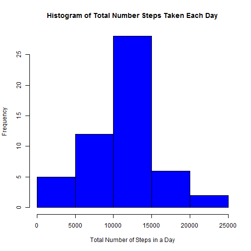
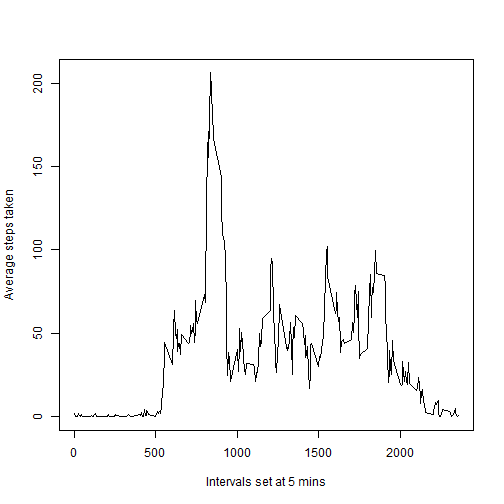
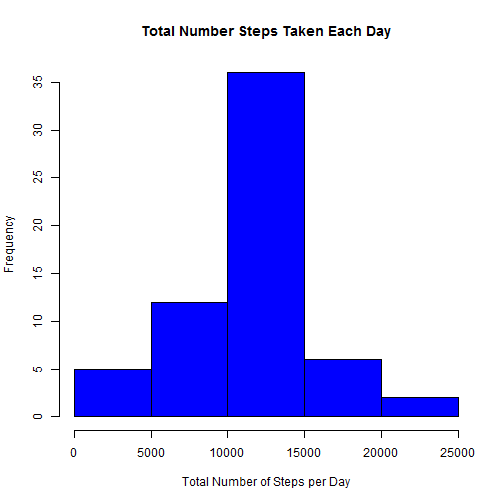

## Loading and preprocessing the data

```r
activity <- read.csv("activity.csv")
attach(activity)
```


## What is mean total number of steps taken per day?
Q1. Calculate the total number of steps taken per day

```r
stepsperday <- aggregate(steps~date, sum, data=activity)
stepsperday
```

```
##          date steps
## 1  2012-10-02   126
## 2  2012-10-03 11352
## 3  2012-10-04 12116
## 4  2012-10-05 13294
## 5  2012-10-06 15420
## 6  2012-10-07 11015
## 7  2012-10-09 12811
## 8  2012-10-10  9900
## 9  2012-10-11 10304
## 10 2012-10-12 17382
## 11 2012-10-13 12426
## 12 2012-10-14 15098
## 13 2012-10-15 10139
## 14 2012-10-16 15084
## 15 2012-10-17 13452
## 16 2012-10-18 10056
## 17 2012-10-19 11829
## 18 2012-10-20 10395
## 19 2012-10-21  8821
## 20 2012-10-22 13460
## 21 2012-10-23  8918
## 22 2012-10-24  8355
## 23 2012-10-25  2492
## 24 2012-10-26  6778
## 25 2012-10-27 10119
## 26 2012-10-28 11458
## 27 2012-10-29  5018
## 28 2012-10-30  9819
## 29 2012-10-31 15414
## 30 2012-11-02 10600
## 31 2012-11-03 10571
## 32 2012-11-05 10439
## 33 2012-11-06  8334
## 34 2012-11-07 12883
## 35 2012-11-08  3219
## 36 2012-11-11 12608
## 37 2012-11-12 10765
## 38 2012-11-13  7336
## 39 2012-11-15    41
## 40 2012-11-16  5441
## 41 2012-11-17 14339
## 42 2012-11-18 15110
## 43 2012-11-19  8841
## 44 2012-11-20  4472
## 45 2012-11-21 12787
## 46 2012-11-22 20427
## 47 2012-11-23 21194
## 48 2012-11-24 14478
## 49 2012-11-25 11834
## 50 2012-11-26 11162
## 51 2012-11-27 13646
## 52 2012-11-28 10183
## 53 2012-11-29  7047
```
Q2. Make a histogram of the total number of steps taken each day

```r
hist(stepsperday[,2], col ="blue", main ="Histogram of Total Number Steps Taken Each Day", xlab="Total Number of Steps in a Day")
```

 

Q3. Calculate and report the mean and median of the total number of steps taken per day

```r
mean(stepsperday[,2])
```

```
## [1] 10766.19
```

```r
median(stepsperday[,2])
```

```
## [1] 10765
```


## What is the average daily activity pattern?
Q1. Make a time series plot (i.e. type = "l") of the 5-minute interval (x-axis) and the average number of steps taken, averaged across all days (y-axis)

```r
stepinterval <- aggregate(steps~interval, mean, data=activity)
plot(stepinterval[,1],stepinterval[,2],type = "l", xlab="Intervals set at 5 mins", ylab="Average steps taken")
```

 
Q2. Which 5-minute interval, on average across all the days in the dataset, contains the maximum number of steps?

```r
stepinterval[,1][which(stepinterval[,2]==max(stepinterval[,2]))]
```

```
## [1] 835
```

## Imputing missing values
Q1. Calculate and report the total number of missing values in the dataset (i.e. the total number of rows with NAs)

```r
sum(is.na(steps))
```

```
## [1] 2304
```
Q2. Devise a strategy for filling in all of the missing values in the dataset. The strategy does not need to be sophisticated. For example, you could use the mean/median for that day, or the mean for that 5-minute interval, etc.
Answer: strategy is to use the mean for that 5-minute interval.

Q3. Create a new dataset that is equal to the original dataset but with the missing data filled in.

```r
activitycomplete <- activity
stepintervalcomplete <- aggregate(steps~interval, mean, data=activitycomplete)
for (i in stepintervalcomplete[,1]){
     #find out how many are missing for one time interval
     missing <- length(activitycomplete[is.na(activitycomplete$steps) & activitycomplete$interval==i,][,1])
     activitycomplete[is.na(activitycomplete$steps) & activitycomplete$interval==i,][,1]=rep(stepintervalcomplete[,2][stepintervalcomplete[,1]==i],missing)
    }
```
Q4. Make a histogram of the total number of steps taken each day and Calculate and report the mean and median total number of steps taken per day. 
Do these values differ from the estimates from the first part of the assignment? 
Answer: Mean is the same but median is a little different
What is the impact of imputing missing data on the estimates of the total daily number of steps?
Answer: For the days with missing intervals, the total daily steps would increase.   
        For the days with no missing intervals, the total daily steps would not change.

```r
stepsperdaycomplete <- aggregate(steps~date, sum, data=activitycomplete)
hist(stepsperdaycomplete[,2],col ="blue", main ="Total Number Steps Taken Each Day", xlab="Total Number of Steps per Day")
```

 

```r
mean(stepsperdaycomplete[,2])
```

```
## [1] 10766.19
```

```r
median(stepsperdaycomplete[,2])
```

```
## [1] 10766.19
```

## Are there differences in activity patterns between weekdays and weekends?

Q1. Create a new factor variable in the dataset with two levels - "weekday" and "weekend" indicating whether a given date is a weekday or weekend day.

```r
activitycomplete$week=weekdays(as.Date(activitycomplete$date))
for (i in 1:length(activitycomplete$week)){
  if (activitycomplete$week[i] == "Saturday" || activitycomplete$week[i] == "Sunday"){
    activitycomplete$week[i] = "weekend"
  }else{ activitycomplete$week[i] = "weekday"}
}
activitycomplete$week=as.factor(activitycomplete$week)
```
 

Q2. Make a panel plot containing a time series plot (i.e. type = "l") of the 5-minute interval (x-axis) and the average number of steps taken, averaged across all weekday days or weekend days (y-axis). 
See the README file in the GitHub repository to see an example of what this plot should look like using simulated data.

```r
library(ggplot2)
library(lattice)
stepintervalcomplete <- aggregate(steps~interval+week, mean, data=activitycomplete)
xyplot(steps ~ interval | week, data = stepintervalcomplete, 
       type = "l", layout = c(1,2), xlab = "Intervals at 5 minutes", ylab = "Number of Steps", 
       main = "Average Steps by 5-minute Interval for Weekends and Weekdays")
```

 
